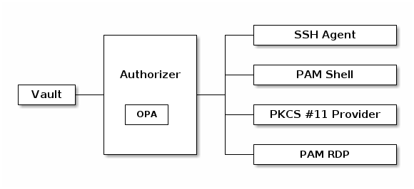

# open-pam
Open Privileged Access Management (PAM)

                                 ┌───────────────────┐
            ┌────────────┐   ┌───┤     SSH Agent     │
            │            │   │   └───────────────────┘
            │            │   │
            │            │   │   ┌───────────────────┐
            │ Authorizer │   ├───┤     PAM Shell     │
┌───────┐   │            │   │   └───────────────────┘
│ Vault ├───┤            ├───┤
└───────┘   │  ┌─────┐   │   │   ┌───────────────────┐
            │  │ OPA │   │   ├───┤ <a href="https://github.com/markkurossi/pkcs11-provider">PKCS #11 Provider</a> │
            │  └─────┘   │   │   └───────────────────┘
            │            │   │
            │            │   │   ┌───────────────────┐
            └────────────┘   └───┤      PAM RDP      │
                                 └───────────────────┘

